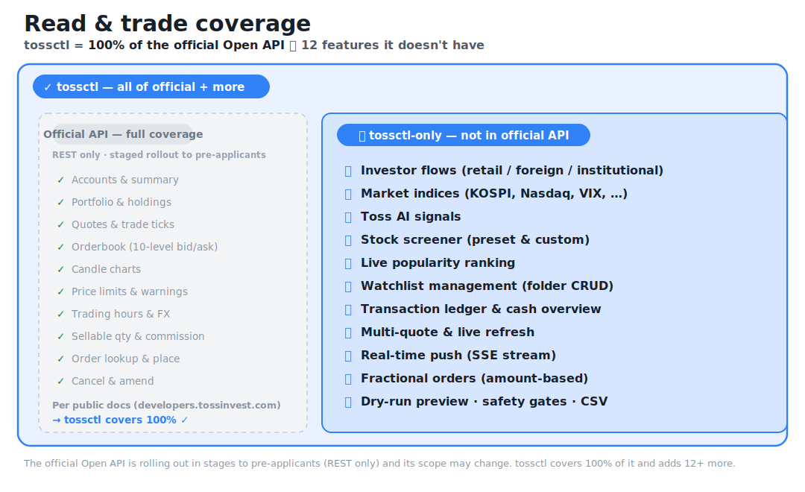
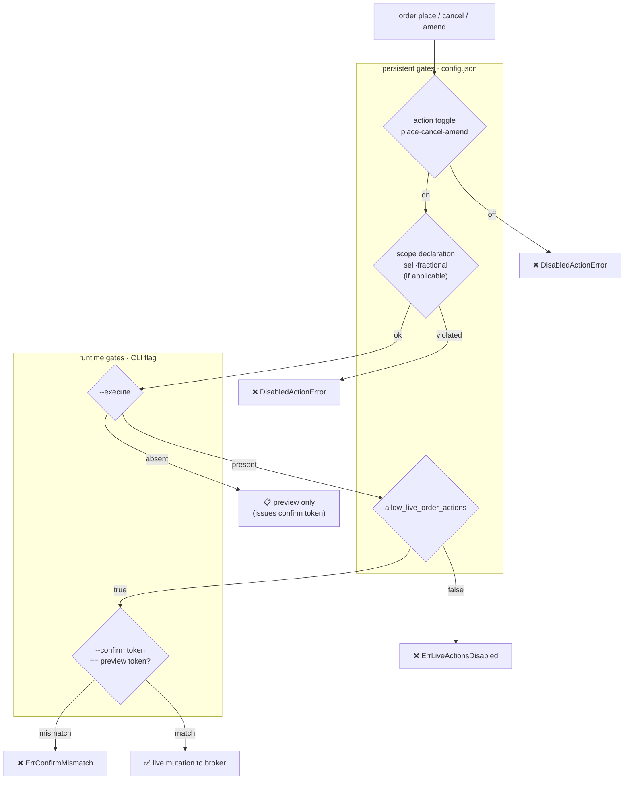

<p align="right"><a href="README.md">한국어</a> · <strong>English</strong></p>

<div align="center">
  <h1>tossinvest-cli</h1>
  <p><strong>An unofficial Toss Securities CLI that connects AI agents to your brokerage — with a broader read &amp; trade coverage than the (upcoming) official Open API.</strong></p>
  <p>Claude Code · Codex · Cursor · OpenClaw · bash · HTTP — any tool drives Toss Securities accounts, quotes, and trades through one command interface (<code>tossctl</code>). It works just as well by hand in a terminal.</p>
  <p><sub>Investor flows · market indices · Toss AI signals · screener · watchlist management · transaction ledger · real-time push · fractional orders · dry-run preview — <strong>tossctl covers areas the official Open API (upcoming) roadmap does not.</strong> <a href="#support-scope">Full comparison ↓</a></sub></p>
</div>

<p align="center">
  
  
  
</p>

<p align="center">
  <a href="docs/migration/.openapi-snapshot.json"></a>
  <a href="docs/migration/.openapi-snapshot.json"></a>
</p>

<p align="center">
  <a href="#quick-start"><strong>Quick Start</strong></a> ·
  <a href="#support-scope"><strong>Support Scope</strong></a> ·
  <a href="#command-reference"><strong>Command Reference</strong></a> ·
  <a href="#faq"><strong>FAQ</strong></a>
</p>

<p align="center">
  <a href="https://github.com/JungHoonGhae/tossinvest-cli/stargazers"></a>
  <a href="LICENSE"></a>
  <a href="https://go.dev/"></a>
  <a href="https://github.com/JungHoonGhae/tossinvest-cli"></a>
  <a href="https://github.com/JungHoonGhae/tossinvest-cli/actions/workflows/ci.yml"></a>
</p>

> [!WARNING]
> This is **not** an official Toss Securities product. It reuses Toss's internal web API unofficially, which may violate Toss Securities' Terms of Service. The API can change without notice, and the author takes no responsibility for account restrictions, losses, or other consequences. Use at your own risk and discretion.

> [!IMPORTANT]
> Trading is fully disabled out of the box. Each action must be explicitly enabled in `config.json` before it can run.

## Quick Start

### For Agents

```text
Install tossinvest-cli:
  curl -fsSL https://raw.githubusercontent.com/JungHoonGhae/tossinvest-cli/main/install.sh | sh
(macOS/Linux) or GitHub Releases (Windows).

Run `tossctl doctor` to verify setup, then complete browser login with
`tossctl auth login`. Use read-only commands first (account, portfolio, quote).
Trading actions stay disabled until config.json explicitly allows them.
Always run `tossctl order preview` before any trading mutation.
```

### For Humans

macOS / Linux:

```bash
curl -fsSL https://raw.githubusercontent.com/JungHoonGhae/tossinvest-cli/main/install.sh | sh
```

Windows (PowerShell):

```powershell
irm https://raw.githubusercontent.com/JungHoonGhae/tossinvest-cli/main/install.ps1 | iex
```

Verify:

```bash
tossctl version
tossctl doctor
tossctl auth login
tossctl account summary --output json
```

> `auth login` requires Google Chrome and Python; the install script sets them up automatically.
> Other install methods (Windows, Homebrew, from source) are in [Install](#install).
>
> After scanning the QR, make sure to tap the **"keep this device signed in"** confirmation on your phone.
> Skipping that second confirmation expires the session after ~1h idle. Verify with `tossctl auth status` showing `Persistence: persistent cookie (expires ...)`.

> **Headless environments (SSH servers, CI):** `tossctl auth login --headless [--qr-output /tmp/toss-qr.png]`.
> The QR URL and answer letter are printed to stderr; forward the URL to your phone to authenticate without a camera.

### Session extension

Toss runs an ~7-day server-side activity expiry separate from the SESSION cookie. From 24h before expiry, every command prints a stderr warning:

```
⚠ session expires in ~18h; run `tossctl auth extend` to renew
```

`tossctl auth extend` sends a push to the Toss app on your phone and waits for approval:

```
$ tossctl auth extend
Waiting for approval in the Toss app on your phone...
✓ Extension complete. New expiry: 2026-05-13 07:03 KST (took 4s)
```

## Support Scope

> **tossctl covers 100% of the official Toss Open API's read & trade coverage — and goes beyond.**
> It maps to every endpoint in the official [Open API docs](https://developers.tossinvest.com/docs) (accounts, holdings, quotes, orderbook, ticks, candles, price limits, sellable quantity, commissions, orders, …), and adds investor flows, market indices, AI signals, screener, watchlist management, transaction ledger, real-time push, fractional orders, dry-run preview, and more — **12+ features that aren't in the official API are tossctl-only.**

<p align="center">
  
</p>

The Toss Securities official Open API is currently **rolling out in stages to pre-applicants** and is a narrow, REST-only API (public docs: <https://developers.tossinvest.com/docs>). The `Official API (planned)` column below reflects that documented coverage, and the `tossctl` column is what we provide. **Every ✅ in the official column is also ✅ for tossctl — we cover 100% of the official API.**

- ✅ supported · ❌ not supported · 🔸 partial
- **`Official API (planned)` column = staged rollout to pre-applicants. ✅/🔸/❌ is expected coverage at launch** (subject to change across rollout phases).
- **Rows where `Official API (planned)` is ❌ = tossctl-only.**
- **Verified version**: the `Official API` column in the tables/diagram below reflects verification against the **official Open API version shown in the badge above** (that version & last-checked date are recorded in [`.openapi-snapshot.json`](docs/migration/.openapi-snapshot.json)). The full spec is mirrored daily to [`docs/migration/openapi.latest.json`](docs/migration/openapi.latest.json); any change is auto-detected, alerted, and updated.

### Read-only · US & KR

| Feature | Command | Official API (planned) | tossctl |
|------|--------|:--:|:--:|
| Accounts / summary | `account list`, `account summary` | ✅ | ✅ |
| Portfolio | `portfolio positions`, `portfolio allocation` (USD for US) | ✅ | ✅ |
| Trade ticks | `quote trades <symbol> --count N` | ✅ | ✅ |
| Orderbook (10-level bid/ask) | `quote orderbook <symbol>` | ✅ | ✅ |
| Price limits | `quote limits <symbol>` (KR) | ✅ | ✅ |
| Trade warnings | `quote warnings <symbol>` (liquidation · alert · VI …) | ✅ | ✅ |
| Trading hours | `market hours` (today + next session when closed) | ✅ | ✅ |
| FX | `market fx` (USD rate · dollar index) | ✅ | ✅ |
| Sellable quantity | `quote sellable <symbol>` (sellable shares for a held symbol) | ✅ | ✅ |
| Commission / tax rate | `quote commission <symbol>` | ✅ | ✅ |
| Orders (pending / completed / single) | `orders list`, `orders completed`, `order show <id>` | ✅ | ✅ |
| Quote | `quote get <symbol>` (OHLC · 52w · market cap · trading value · strength) | 🔸 *(no strength/52w etc.)* | ✅ |
| Candle chart | `quote chart --interval 1m\|3m\|5m\|10m\|15m\|30m\|60m` | 🔸 *(1m / daily only)* | ✅ |
| **Multi-quote / live refresh** | `quote batch <sym>[,sym,...]` (`--chart` · `--live`) | ❌ | ✅ |
| **Investor flows** | `quote flows <symbol>` (retail · foreign · inst., KR) | ❌ | ✅ |
| **Market indices** | `market index` (KOSPI · KOSDAQ · Nasdaq · S&P500 · VIX …) | ❌ | ✅ |
| **Live popularity ranking** | `market ranking --size N` | ❌ | ✅ |
| **Net-buy ranking by investor** | `market investors` (foreign · institution · retail top net-buy) | ❌ | ✅ |
| **Earnings calendar** | `market earnings` (upcoming earnings calls) | ❌ | ✅ |
| **Toss AI signals** | `market signals` (per-symbol AI signal · keywords · move) | ❌ | ✅ |
| **Stock screener** | `market screener [id]` (preset) · `--filter '<json>'` (custom) `--nation kr\|us` | ❌ | ✅ |
| **Watchlist read & management** | `watchlist list`·`groups`, `watchlist group create\|rename\|delete`, `watchlist add\|remove --group <id>` | ❌ | ✅ |
| **Transaction ledger** | `transactions list --market us\|kr` (trades · transfers · dividends) | ❌ | ✅ |
| **Cash overview** | `transactions overview --market us\|kr` (orderable · withdrawable · incoming) | ❌ | ✅ |
| **CSV export** | `export positions\|orders --market`, `transactions list --output csv` | ❌ | ✅ |
| **Real-time push** | `push listen` (SSE stream — order/price change events) | ❌ *(official is REST only)* | ✅ |

### Trading

The official API also offers order create/amend/cancel, but tossctl's trading UX/safety — **fractional orders, currency mode, dry-run preview, config-based safety gates** — is our own.

| Feature | Command | Required config | Official API (planned) | tossctl |
|------|--------|-------------|:--:|:--:|
| Limit buy (US/KR) | `order place --side buy --price <value>` | `place` | ✅ | ✅ |
| Limit sell (US/KR) | `order place --side sell --price <value>` | `place` + `sell` | ✅ | ✅ |
| Korean stock trading | `order place --market kr` (6-digit codes auto-detected) | `place` | ✅ | ✅ |
| Cancel | `order cancel --order-id <id>` | `cancel` | ✅ | ✅ |
| Amend | `order amend --order-id <id>` | `amend` | ✅ | ✅ |
| **Fractional buy (US, amount-based)** | `order place --fractional --amount <value>` (KRW default; `--currency-mode USD`) | `place` + `fractional` | ❌ | ✅ |
| **Dry-run / preview** | `order preview` (validate without sending) | — | ❌ | ✅ |

All trades also require `allow_live_order_actions=true`. Fractional orders auto-convert to market orders and are amount-based (`--currency-mode KRW` default or `USD`).

US limit prices choose interpretation via `--currency-mode`: `KRW` (default, converted to USD at the server rate) or `USD` (sent as-is). e.g. `order place --symbol MRVL --side buy --qty 1 --price 158.01 --currency-mode USD`.

### Why tossctl — the official API is a fraction of Toss

The official Open API offers only **basic REST read/order** (~20 endpoints). Toss's
own web app (WTS) actually uses **~430 meaningful read/trade endpoints** — that's
after excluding noise like onboarding, KYC, terms, promotions, and telemetry.

> **The official Open API covers only ~4% of that.** tossctl works across the
> rest, already ships features the official API lacks (investor flows, market indices,
> AI signals, screener, by-investor net-buy, earnings calendar, real-time push,
> fractional orders, dry-run preview, …), and **keeps implementing the remaining endpoints.**

Why tossctl wins long-term:

- **Breadth** — the official API opens a narrow API slowly; tossctl tracks the whole web API (catalog below) and is always wider.
- **Speed** — when Toss ships a new web feature, the weekly monitor flags the new endpoint and we implement it without waiting for an official release.
- **Superset** — whatever the official API covers, tossctl [already covers 100%](#support-scope).

#### WTS web API catalog (continuously tracked)

Every `/api/*` endpoint is extracted from the web bundles and classified as
**implemented / next candidate / intentionally excluded**; additions, changes, and
removals are caught by a weekly monitor. (Badge counts use the **meaningful API,
excluding noise**, and auto-update from the catalog.)

<p align="center">
  <a href="docs/reverse-engineering/wts-endpoints.json"></a>
  <a href="docs/reverse-engineering/wts-endpoints.json"></a>
  <a href="docs/reverse-engineering/wts-endpoints.json"></a>
  
</p>

- Full catalog: [`docs/reverse-engineering/wts-endpoints.json`](docs/reverse-engineering/wts-endpoints.json).

### Safety Model

Trading is disabled by default. For a single live order to reach the broker, it must pass both the **persistent (config) gates** and the **runtime (flag) gates**.



- **Persistent gates (config.json):** `place`/`cancel`/`amend` path toggles + `sell`/`fractional` scope declarations + `allow_live_order_actions` master kill-switch. (Market US/KR is not a gate — a KR order is no riskier than a US one, so they're treated symmetrically.)
- **Runtime gates (every run):** `--execute` (perform the real mutation, not preview) + `--confirm <token>` (the per-order token from preview).
- The real safety is the per-order `--confirm <token>` — you can only get it by running preview, so an unintended order is blocked by a token mismatch.

> **v0.5.x simplification:** removed the redundant TTL grant layer (`internal/permissions`; `allow_live_order_actions` already provides the same protection) and retired the misnamed `--dangerously-skip-permissions` (no permissions left to point at, and its meaning was inverted). The old flag is accepted as a deprecated no-op alias for one release to keep scripts/agents working.

## Config

```bash
tossctl config init
tossctl config show
```

```json
{
  "$schema": "https://raw.githubusercontent.com/JungHoonGhae/tossinvest-cli/main/schemas/config.schema.json",
  "schema_version": 3,
  "trading": {
    "place": false,
    "sell": false,
    "fractional": false,
    "cancel": false,
    "amend": false,
    "allow_live_order_actions": false,
    "dangerous_automation": {
      "accept_fx_consent": false
    }
  },
  "update_check": {
    "enabled": true
  }
}
```

| Field | Description |
|------|------|
| `place` | Allow the `order place` path (broker API branch: place) |
| `cancel` | Allow the `order cancel` path |
| `amend` | Allow the `order amend` path |
| `sell` | Allow sell orders (`place` also required) — **scope declaration**: limit yourself to buy-only / include sell |
| `fractional` | Allow fractional orders (`place` also required, US market orders only) — **scope declaration** |
| `allow_live_order_actions` | Master kill-switch — for any of `place/cancel/amend` to reach the real broker, this must also be `true` |
| `accept_fx_consent` | Auto-proceed through post-prepare FX confirmation |
| `update_check.enabled` | New-version notice (24h cache, GitHub Releases API, silent on failure). Default `true`. Auto-skipped for JSON/CSV output, non-tty, and dev builds |

> **Two kinds of toggles:**
> - **Path gates** (`place`, `cancel`, `amend`) — independently switch the three actions whose broker API branches actually differ.
> - **Scope declarations** (`sell`, `fractional`) — let you declare "I never place this category of order" to guard against mistakes/bugs/agent misbehavior.
>
> `trading.grant`, `dangerous_automation.complete_trade_auth`, `dangerous_automation.accept_product_ack` were removed in v0.4.3, and `trading.kr` (an asymmetric market gate — a KR order is no riskier than a US one, so markets are now symmetric) in v0.5.2. Leftover keys are ignored, surfaced as a one-line stderr warning (24h backoff), and flagged by `config status`/`doctor`.

## Order Examples

### Limit buy (US)

```bash
tossctl config init
# config.json: place, allow_live_order_actions → true

tossctl order preview \
  --symbol TSLL --side buy --qty 1 --price 18000 --output json

tossctl order place \
  --symbol TSLL --side buy --qty 1 --price 18000 \
  --execute --confirm <token> \
  --output json
```

### Fractional buy (US, amount-based)

```bash
# config.json: place, fractional, allow_live_order_actions → true

tossctl order place \
  --symbol TSLL --side buy --fractional --amount 1000 --qty 0 \
  --execute --confirm <token>
```

### Korean stock buy

```bash
# config.json: place, allow_live_order_actions → true
# (6-digit codes are auto-detected as KR — no --market kr needed)

tossctl order place \
  --symbol 005930 --side buy --qty 1 --price 200000 \
  --execute --confirm <token>
```

### Multi-quote

```bash
tossctl quote batch TSLL 005930 GOOG VOO --output table
```

## What This Project Is Not

| Not | Description |
|---|---|
| An official API SDK | Not an official Toss Securities API or supported SDK. Migration plan once the official Open API ([pre-application page](https://corp.tossinvest.com/ko/open-api)) launches: [`docs/migration/open-api.md`](docs/migration/open-api.md). |
| A general trading client | Does not fully support every order type and market. |
| Unrestricted auto-trading | Not aimed at being an auto-trader that fires without safety gates. |

## Install

<details>
<summary>Homebrew, Windows, from source</summary>

#### Homebrew (macOS / Linux)

```bash
brew tap JungHoonGhae/tossinvest-cli
brew install tossctl
```

#### Windows (PowerShell)

```powershell
irm https://raw.githubusercontent.com/JungHoonGhae/tossinvest-cli/main/install.ps1 | iex
```

Installs to `%LOCALAPPDATA%\tossctl` and adds it to the user PATH automatically.
Open a new terminal window and `tossctl` is ready to use.

For a manual install, download `tossctl-windows-amd64.zip` from [Releases](https://github.com/JungHoonGhae/tossinvest-cli/releases/latest).

#### From source

```bash
git clone https://github.com/JungHoonGhae/tossinvest-cli.git
cd tossinvest-cli
make build

cd auth-helper
python3 -m pip install -e .
```

</details>

## Command Reference

### Read-only

```bash
tossctl account list
tossctl account summary
tossctl portfolio positions
tossctl portfolio allocation
tossctl orders list
tossctl orders completed --market us|kr|all
tossctl order show <id>
tossctl quote get <symbol>
tossctl quote batch <symbol> [symbol...]
tossctl quote orderbook|sellable|commission <symbol>
tossctl quote chart <symbol> --interval 5m
tossctl quote trades|limits|warnings|flows <symbol>
tossctl market hours|fx|index|ranking|signals|investors|earnings
tossctl market screener [id] --nation kr|us
tossctl watchlist list|groups
tossctl transactions list|overview --market us|kr
tossctl export positions|orders --market us|kr|all
```

### Trading

```bash
tossctl order preview --symbol <sym> --side <buy|sell> --qty <n> --price <krw>
tossctl order preview --symbol <sym> --side buy --fractional --amount <krw> --qty 0
tossctl order place ...flags... --execute --confirm <token>
tossctl order cancel --order-id <id> --symbol <sym> ...
tossctl order amend --order-id <id> ...
```

### Real-time push

```bash
tossctl push listen                # subscribe SSE, JSONL to stdout (Ctrl+C to stop)
tossctl push listen --retry=false  # disable reconnect
```

Subscribes to Toss's SSE channel and streams `pending-order-refresh` · `purchase-price-refresh` · `share-holdings` · `web-push` events as JSONL. Event taxonomy: [`docs/reverse-engineering/push-events.md`](docs/reverse-engineering/push-events.md).

### System

```bash
tossctl version
tossctl doctor
tossctl doctor --report     # JSON diagnostic bundle (for issues; paths auto-redacted)
tossctl config init|show
tossctl auth login|status|extend|doctor|logout
```

### API regression watch

```bash
tossctl monitor api           # schema-probe 16 endpoints (parallel); exit 0 pass, 1 fail
tossctl monitor api --quiet   # for cron
```

Checks the response schema of 16 read-only endpoints in parallel, using your own session on your own machine — to catch Toss server-side body-contract changes (like [#29](https://github.com/JungHoonGhae/tossinvest-cli/issues/29)) early. It only returns an exit code, so you compose alert channels (Discord / Slack / ntfy / macOS / email) on the right side of `|| <command>` in your cron line. Recipes: [`AGENTS.md`](AGENTS.md), setup guide: [`docs/operations.md`](docs/operations.md).

## Development

```bash
make build
make test
make fmt
make tidy
```

## FAQ

**Can it actually place orders?**
US/KR limit buy/sell, US fractional buy, and same-day pending cancel are live-verified. `amend` needs more verification. Every trade runs only after the action is enabled in `config.json`.

**Is this an official API?**
No. It's an unofficial project that reuses the internal web API.

**Why is Playwright needed?**
To capture the login session via a browser flow. Read/trade logic lives in the Go CLI.

**Something seems broken — where do I start?**
Run `tossctl doctor --report` and paste the JSON into a GitHub issue. It captures version, OS, Chrome version, session state, live responses from the three `wts-api`/`wts-cert-api`/`wts-info-api` endpoints (200/401/403), file permissions, and leftover temp files — so most regressions are quick to diagnose. The home directory is auto-redacted to `~` so your username isn't exposed.

## Docs

- [`docs/architecture.md`](docs/architecture.md)
- [`docs/configuration.md`](docs/configuration.md)
- [`docs/reverse-engineering/`](docs/reverse-engineering/)
- [`docs/trading/`](docs/trading/)
- [`auth-helper/README.md`](auth-helper/README.md)

## Local State Paths

| Path | Description |
|------|------|
| `<config dir>/config.json` | Trading config |
| `<config dir>/session.json` | Browser session |
| `<config dir>/trading-lineage.json` | Order ref tracking |
| `<cache dir>/update-check.json` | Backoff cache for version / session-expiry / config warnings |

Override paths with `--config-dir` and `--session-file`.

## Contributing

Bug reports and PRs welcome.

## Support

If this helped, consider supporting maintenance.

<a href="https://www.buymeacoffee.com/lucas.ghae">
  
</a>

## License

MIT
