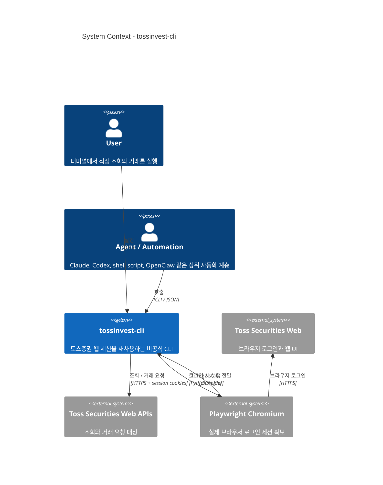
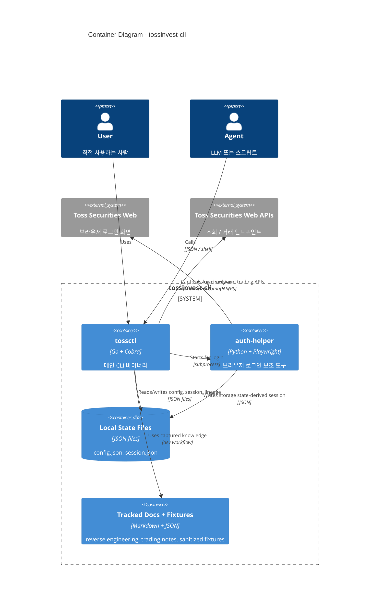
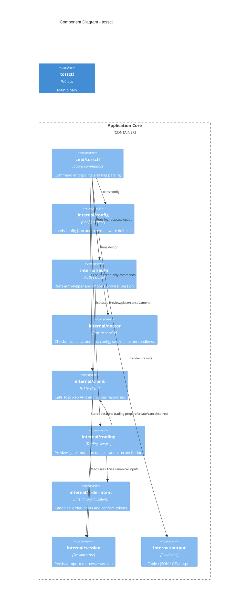
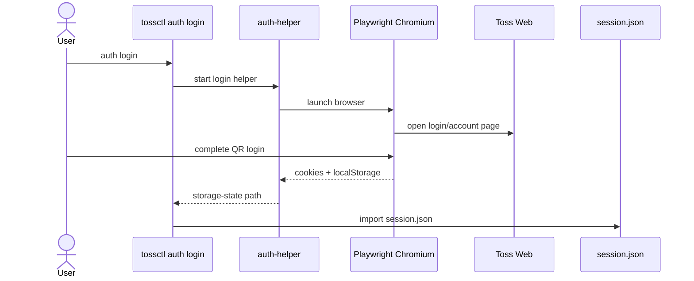
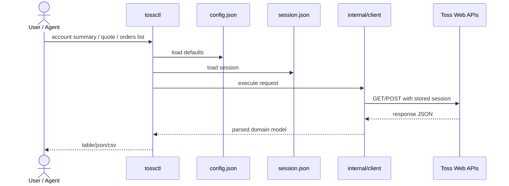
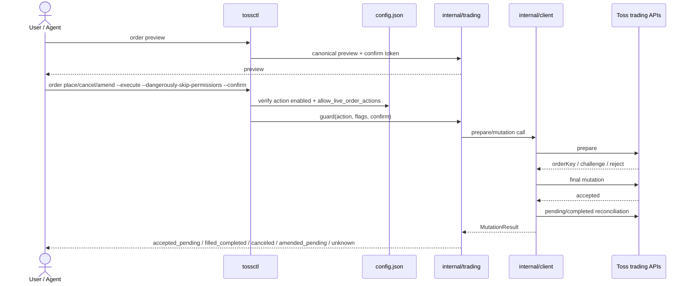

# Architecture

`tossinvest-cli`는 토스증권 웹 세션을 재사용하는 비공식 CLI입니다. 현재 구조는 `브라우저 로그인 보조 도구 + Go CLI + 로컬 상태 파일 + Toss 증권 웹 API`로 나뉘어 있습니다.

이 문서는 현재 저장소에 구현된 기준으로 아키텍처를 정리합니다. 목표는 두 가지입니다.

- 사람이 전체 구조를 빠르게 이해할 수 있게 하기
- 이후 LLM이나 다른 자동화 도구가 같은 경계를 기준으로 기능을 확장할 수 있게 하기

## 현재 상태

현재 구현 범위는 아래와 같습니다.

- 브라우저 로그인 기반 세션 저장과 재사용
  - QR 1차 + "이 기기 로그인 유지" 2차 확인까지 대기 후 저장 → persistent SESSION (서버 idle timeout 면제)
  - headless 모드 지원 — `auth login --headless [--qr-output <path>]` (SSH/CI 환경용)
  - `auth extend` — 토스 서버 측 ~7일 활성 timer를 폰 푸시 승인 한 번으로 연장 (1년 SESSION 쿠키와 별개의 만료 시계). 24h 미만 남았을 때 모든 명령에서 stderr 한 줄 경고
- 계좌, 포트폴리오, 미체결 주문, 관심종목, 시세 조회
- `orders completed`, `order show <id>` 기반 주문 상태 조회
- 거래내역 ledger: `transactions list/overview` — 매매/입출금/배당/주식입출고 + 현금 overview (KR/US, table/JSON/CSV, 200일 캡)
- 실시간 푸시: `push listen` — 토스 SSE 채널(`sse-message.tossinvest.com`) 구독으로 주문/가격/보유종목 변경 알림을 JSONL 스트림으로 출력 (이벤트 분류는 [`docs/reverse-engineering/push-events.md`](reverse-engineering/push-events.md))
- 거래 베타
  - `US/KR buy/sell limit` + `US fractional (market)`
  - sell: `trading.sell=true`, KR: `trading.kr=true`, fractional: `trading.fractional=true`
  - `KRW`
  - `place`
  - same-day pending `cancel`
  - `amend` wiring 존재, 추가 live 검증 필요

거래는 기본적으로 꺼져 있습니다. 사용자가 `config.json`에서 기능별로 직접 열고, 그 다음에도 explicit flags(--execute / --dangerously-skip-permissions / --confirm)를 통과해야만 mutation이 실행됩니다.

## 설계 원칙

- 기본은 `read-only`
- 로그인 획득과 API 호출을 분리
- 사람과 에이전트 모두 같은 CLI 표면을 사용
- 거래 mutation은 별도 gate와 reconciliation을 거침
- 상태는 로컬 파일로 명시적으로 저장
- discovery 문서와 fixture는 코드와 분리해서 유지

## System Context

## Container View

## Component View

## Key Flows

### 1. Browser-assisted login

### 2. Read-only command

### 3. Trading mutation with safety gates

## Safety Model

거래 mutation은 아래 순서로 열립니다.

1. `config.json`
   - **경로 게이트:** `place`, `cancel`, `amend` (broker API 분기별 허용)
   - **스코프 선언:** `sell`, `kr`, `fractional` (유저 자가 제한)
   - **마스터 킬스위치:** `allow_live_order_actions` (실계좌 도달 차단)
   - **자동화:** `dangerous_automation.accept_fx_consent`
3. `--execute`
4. `--dangerously-skip-permissions`
5. `--confirm <token>`

즉, config가 열려 있어도 매번 CLI 실행 시점의 명시적 확인이 필요합니다.

> `v0.4.3`에서 `trading.grant`, `dangerous_automation.complete_trade_auth`, `dangerous_automation.accept_product_ack`는 제거되었습니다 — 모두 실제로 어떤 동작도 제어하지 않던 dead toggle이었습니다. `v0.5.0`에서는 중복이던 TTL grant 레이어(`internal/permissions`)도 제거되었습니다 (`allow_live_order_actions` 마스터 스위치가 같은 보호를 제공). 구 config에 남아있어도 무시되며, 일반 명령 실행 시 stderr 경고 1줄(24h backoff)로 안내되고 `tossctl doctor`의 `legacy_config` 체크에서도 감지됩니다.

## Local State

로컬 상태는 아래 파일로 관리됩니다.

| File | Role | Mode |
|---|---|---|
| `config.json` | 거래 기능 허용 여부 | `0o600` |
| `session.json` | 브라우저에서 가져온 세션 (쿠키 + storage) | `0o600` |
| `trading-lineage.json` | amend/cancel 후 order ref 추적 | `0o600` |

상태 디렉토리 (`~/Library/Application Support/tossctl/` 등)는 `0o700` 으로 생성되어 같은 호스트의 다른 사용자가 목록 조회 못함. 기존 v0.4.0 이전에 생성된 디렉토리는 `0o755`로 남아있을 수 있으므로 `tossctl doctor --report` 의 `file_modes` 항목에서 확인 + 필요 시 `chmod 0700` 수동 정리.

기본 경로는 `tossctl doctor`와 `tossctl config show`로 확인할 수 있습니다.

## Package Map

| Package | Role |
|---|---|
| `cmd/tossctl` | 명령 진입점 |
| `internal/config` | config.json 로드, 기본값, schema |
| `internal/auth` | 로그인 orchestration, 세션 import |
| `auth-helper/` | Python + Playwright 로그인 보조 |
| `internal/client` | Toss 웹 API 호출과 응답 파싱 |
| `internal/trading` | preview, gate, mutation orchestration |
| `internal/orderintent` | canonical input, confirm token |
| `internal/session` | session.json 저장 |
| `internal/output` | table/json/csv 렌더링 |
| `docs/reverse-engineering` | read-only discovery 문서 |
| `docs/trading` | trading discovery 문서 |

## Current Gaps

아래는 아직 남아 있는 항목입니다.

- `amend`의 추가 live 검증
- `place`와 `amend`의 상태 판별 추가 검증
- 비소수점 시장가 주문 (US/KR)
- interactive auth challenge가 필요한 mutation 분기 일반화

## Related Docs

- [`configuration.md`](./configuration.md)
- [`trading/README.md`](./trading/README.md)
- [`reverse-engineering/`](./reverse-engineering/)
